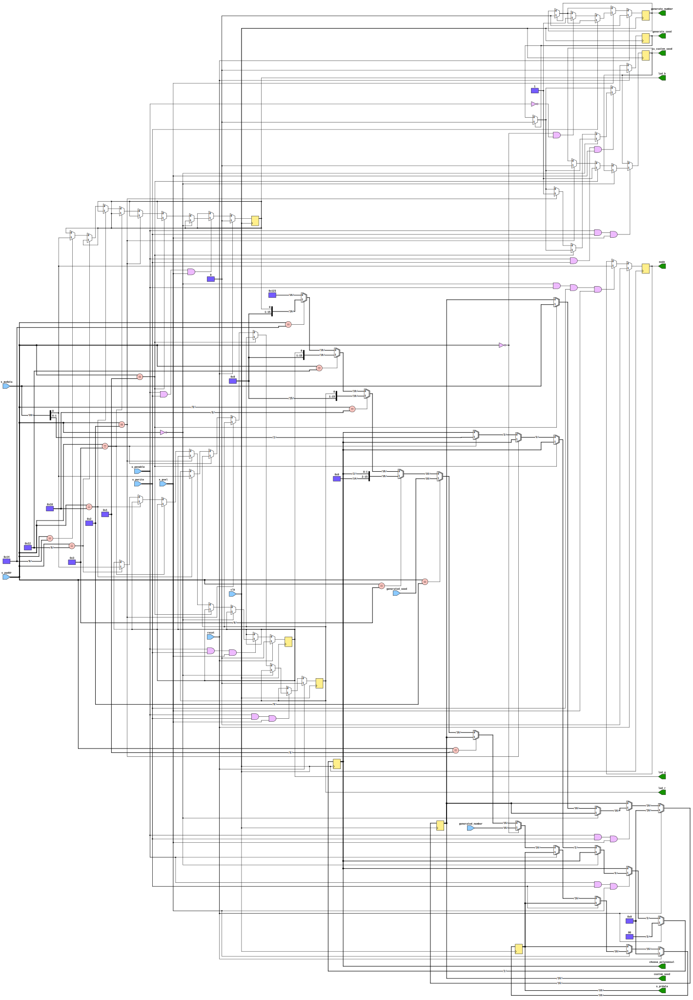

# Entity: config_regs

- **File**: config_regs.vhd

## Diagram

## Ports

| Port name         | Direction | Type                          | Description                                    |
| ----------------- | --------- | ----------------------------- | ---------------------------------------------- |
| clk               | in        | std_logic                     |                                                |
| reset             | in        | std_logic                     |                                                |
| s_paddr           | in        | std_logic_vector(7 downto 0)  | APB address                                    |
| s_psel            | in        | std_logic                     | APB select                                     |
| s_penable         | in        | std_logic                     | APB enable                                     |
| s_pwrite          | in        | std_logic                     | APB write                                      |
| s_pwdata          | in        | std_logic_vector(15 downto 0) | APB write data                                 |
| s_prdata          | out       | std_logic_vector(15 downto 0) | APB read data                                  |
| generated_number  | in        | std_logic_vector(15 downto 0) | Generated random number                        |
| generated_seed    | in        | std_logic_vector(15 downto 0) | Generated seed from RNG                        |
| mode              | out       | std_logic                     | Mode for RNG                                   |
| custom_seed       | out       | std_logic_vector(15 downto 0) | Custom seed for RNG                            |
| generate_seed     | out       | std_logic                     | Generate new seed from radiactive decay signal |
| is_custom_seed    | out       | std_logic                     | Custom seed flag                               |
| choose_polynomial | out       | std_logic_vector(1 downto 0)  | Polynomial selection for LFSR                  |
| generate_number   | out       | std_logic                     | Generate new random number                     |
| led_r             | out       | std_logic                     | LED red                                        |
| led_g             | out       | std_logic                     | LED green                                      |
| led_b             | out       | std_logic                     | LED blue                                       |

## Signals

| Name                | Type                          | Description                                     |
| ------------------- | ----------------------------- | ----------------------------------------------- |
| s_mode              | std_logic                     | Mode for RNG                                    |
| s_custom_seed       | std_logic_vector(15 downto 0) | Custom seed for RNG                             |
| s_generate_seed     | std_logic                     | Generate new seed from radioactive decay signal |
| s_is_custom_seed    | std_logic                     | Custom seed flag                                |
| s_generate_number   | std_logic                     | Generate new random number                      |
| s_choose_polynomial | std_logic_vector(1 downto 0)  | Polynomial selection for LFSR                   |
| s_led_r             | std_logic                     | LED red signal                                  |
| s_led_g             | std_logic                     | LED green signal                                |
| s_led_b             | std_logic                     | LED blue signal                                 |

## Processes

- main: ( clk )

## Schematics

