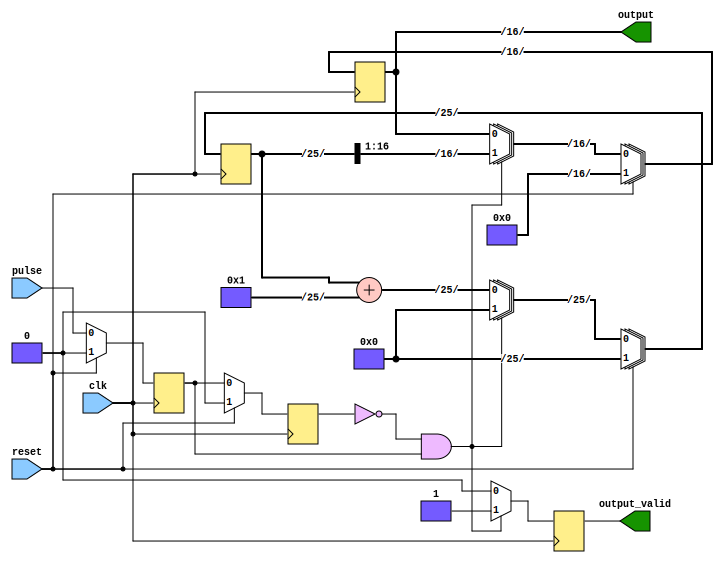

# Entity: decay_sampler

- **File**: decay_sampler.vhd

## Diagram

## Generics

| Generic name  | Type    | Value    | Description                       |
| ------------- | ------- | -------- | --------------------------------- |
| clk_freq      | integer | 12000000 | Clock frequency in Hz             |
| counter_slice | integer | 2        | Clock scaler for the decay signal |
| output_width  | integer | 16       | Output width in bits              |

## Ports

| Port name    | Direction | Type                                        | Description                              |
| ------------ | --------- | ------------------------------------------- | ---------------------------------------- |
| clk          | in        | std_logic                                   | Clock signal                             |
| reset        | in        | std_logic                                   | Reset signal                             |
| pulse        | in        | std_logic                                   | Pulses from the radioactive decay sensor |
| output_valid | out       | std_logic                                   | Output valid signal                      |
| output       | out       | std_logic_vector(output_width - 1 downto 0) | Output random number                     |

## Signals

| Name         | Type                                        | Description                 |
| ------------ | ------------------------------------------- | --------------------------- |
| counter      | unsigned(counter_width downto 0)            | Counter for clock cycles    |
| s_output     | std_logic_vector(output_width - 1 downto 0) | Output random number signal |
| s_pulse      | std_logic                                   | Pulse signal                |
| s_pulse_prev | std_logic                                   |                             |

## Constants

| Name          | Type    | Value                               | Description           |
| ------------- | ------- | ----------------------------------- | --------------------- |
| counter_width | integer | integer(ceil(log2(real(clk_freq)))) | Counter width in bits |

## Processes

- unnamed: ( clk )

## Schematics

