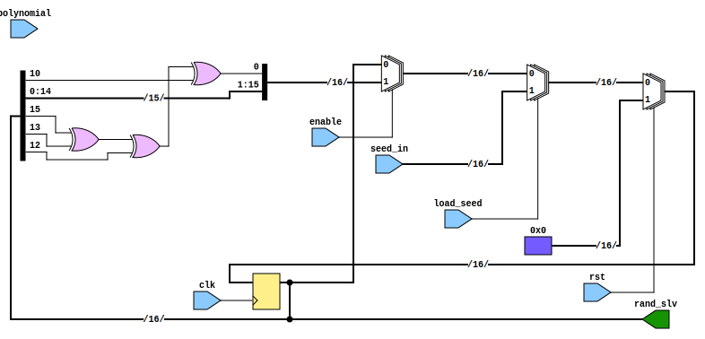
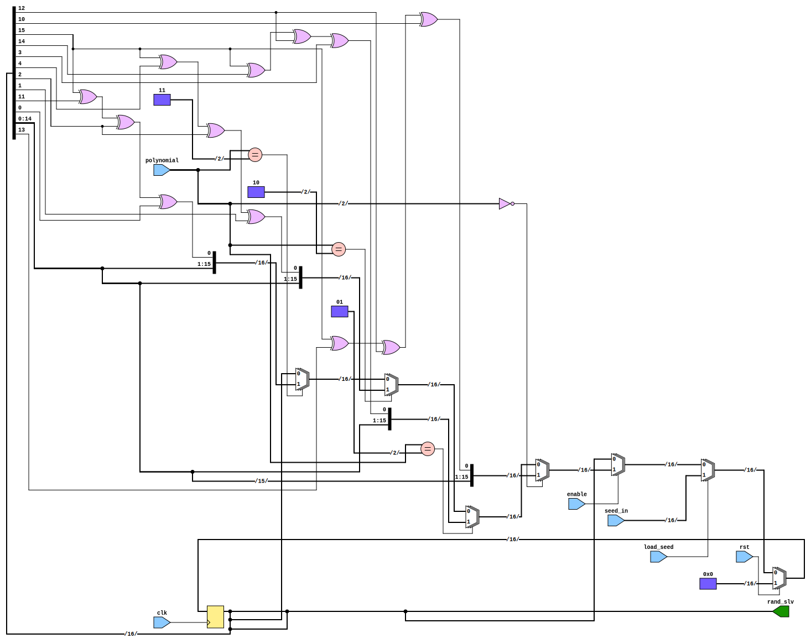

# Entity: rand_gen

- **File**: rand_gen.vhd

## Diagram

## Generics

| Generic name | Type    | Value | Description                 |
| ------------ | ------- | ----- | --------------------------- |
| LEN          | integer | 16    | Length of the output vector |

## Ports

| Port name  | Direction | Type                               | Description                   |
| ---------- | --------- | ---------------------------------- | ----------------------------- |
| clk        | in        | std_logic                          | Clock signal                  |
| rst        | in        | std_logic                          | Reset signal                  |
| enable     | in        | std_logic                          | Enable signal                 |
| load_seed  | in        | std_logic                          | Load seed signal              |
| seed_in    | in        | std_logic_vector(15 downto 0)      | 16bit seed number             |
| polynomial | in        | std_logic_vector(1 downto 0)       | Polynomial selection for LFSR |
| rand_slv   | out       | std_logic_vector(LEN - 1 downto 0) | Random number output vector   |

## Signals

| Name      | Type                               | Description |
| --------- | ---------------------------------- | ----------- |
| lfsr      | std_logic_vector(15 downto 0)      |             |
| prng_bits | std_logic_vector(LEN - 1 downto 0) |             |

## Processes

- main: ( clk )
- update_output: ( lfsr )

## Schematics

### Single polynomial LFSR

### Multiple polynomial LFSR

