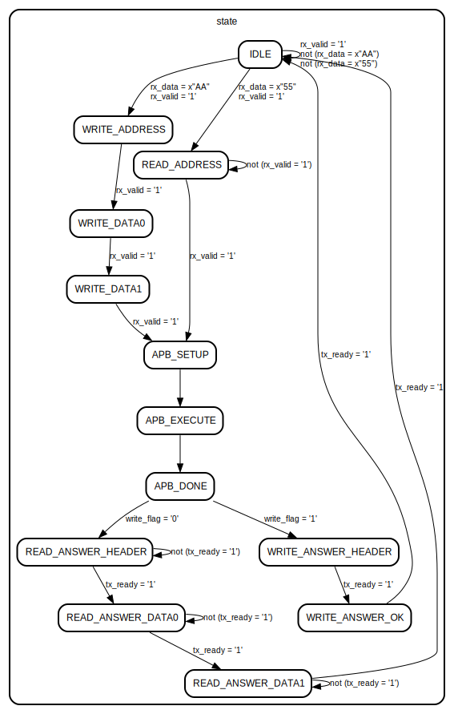
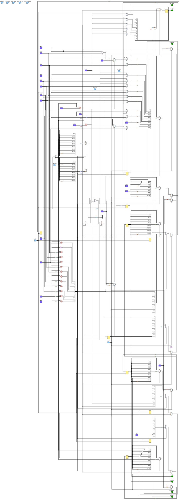

# Entity: spi_protocol

- **File**: spi_protocol.vhd

## Diagram

## Generics

| Generic name              | Type                 | Value | Description              |
| ------------------------- | -------------------- | ----- | ------------------------ |
| TransWidth_g              | positive             | 8     | SPI transaction width    |
| SpiCpol_g                 | natural range 0 to 1 | 0     | SPI clock polarity       |
| SpiCpha_g                 | natural range 0 to 1 | 0     | SPI clock phase          |
| LsbFirst_g                | boolean              | false | LSB first                |
| ConsecutiveTransactions_g | boolean              | false | Consecutive transactions |
| InternalTriState_g        | boolean              | true  | Internal tri-state       |

## Ports

| Port name     | Direction | Type                                        | Description        |
| ------------- | --------- | ------------------------------------------- | ------------------ |
| clk           | in        | std_logic                                   | Clock input        |
| reset         | in        | std_logic                                   | Reset input        |
| Rx_Valid      | in        | std_logic                                   | RX data valid      |
| Rx_Data       | in        | std_logic_vector(TransWidth_g - 1 downto 0) | RX data            |
| Tx_Valid      | out       | std_logic                                   | TX data valid      |
| Tx_Ready      | in        | std_logic                                   | TX data ready      |
| Tx_Data       | out       | std_logic_vector(TransWidth_g - 1 downto 0) | TX data            |
| Resp_Valid    | in        | std_logic                                   | Response valid     |
| Resp_Sent     | in        | std_logic                                   | Response sent      |
| Resp_Aborted  | in        | std_logic                                   | Response aborted   |
| Resp_CleanEnd | in        | std_logic                                   | Response clean end |
| m_paddr       | out       | std_logic_vector(7 downto 0)                | APB address        |
| m_psel        | out       | std_logic                                   | APB select         |
| m_penable     | out       | std_logic                                   | APB enable         |
| m_pwrite      | out       | std_logic                                   | APB write          |
| m_pwdata      | out       | std_logic_vector(15 downto 0)               | APB write data     |
| m_prdata      | in        | std_logic_vector(15 downto 0)               | APB read data      |

## Signals

| Name       | Type                          | Description         |
| ---------- | ----------------------------- | ------------------- |
| state      | SPI_STATUS                    | State machine state |
| write_flag | std_logic                     | Write flag          |
| apb_data   | std_logic_vector(15 downto 0) | APB data            |
| address    | std_logic_vector(7 downto 0)  | Address             |
| wr_data    | std_logic_vector(15 downto 0) | Write data          |

## Enums

### *SPI_STATUS*

| Name                | Description                    |
| ------------------- | ------------------------------ |
| WRITE_ADDRESS       | Write address select           |
| WRITE_DATA0         | Write data, bit 16 to 9        |
| WRITE_DATA1         | Write data, bit 8 to 1         |
| WRITE_ANSWER_HEADER | Write answer header for master |
| WRITE_ANSWER_OK     | Write answer OK for master     |
| READ_ADDRESS        | Read address select            |
| READ_ANSWER_HEADER  | Read answer header for master  |
| READ_ANSWER_DATA0   | Read answer data, bit 16 to 9  |
| READ_ANSWER_DATA1   | Read answer data, bit 8 to 1   |
| APB_SETUP           | APB setup                      |
| APB_EXECUTE         | APB execute                    |
| APB_DONE            | APB done                       |
| IDLE                | Idle state                     |

## Processes

- main: ( clk )

## State machines

## Schematics

